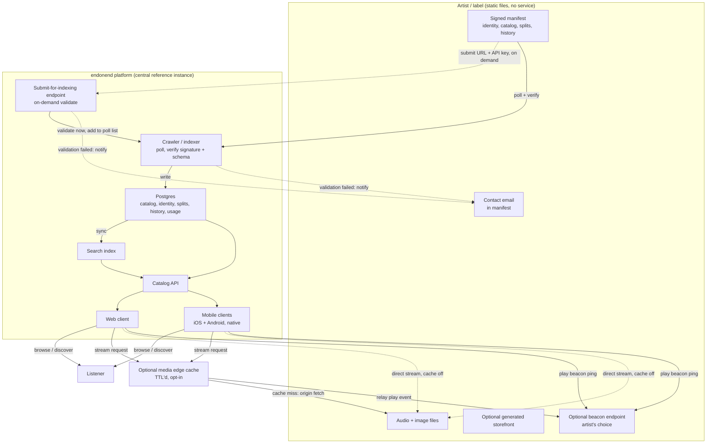

# Architecture

```
Status: Proposed
Date: 2026-09-07
Type: Spec
References: [0001-purpose.md](./0001-purpose.md)
```

## Overview

This document proposes a concrete architecture: languages, deployment, CI/CD, the centralized platform's persistence layer, and how the artist/album/label protocol is enforced. It must stay consistent with the principles Accepted in [0001-purpose.md](./0001-purpose.md), in particular artist-owned infrastructure, container-based deployment with no vendor lock-in, protocol plus centralized reference experience, verifiable listening signals, and verifiable artists and labels with open history. Where a choice below isn't strictly required by those principles, it's marked as a recommendation that can be revisited later in a narrow `Decision` doc, per `KB/README.md`.

**This is the MVP architecture.** It defines the minimum system needed to validate the core mechanism: artist-owned static catalogs, an endonend platform that discovers, verifies, and indexes them, and basic playback. Playlists, fan sharing, radio/shuffle-style discovery, and broader cross-instance federation are explicitly out of scope here, per the non-goals and "What comes next" roadmap already in [0001-purpose.md](./0001-purpose.md), and will get their own specs once the MVP is validated.

## System components

The system has two parts, not three: there is no artist-side service.

- **Artist catalog (static files, not a service).** An artist or label publishes a signed manifest file plus their audio and image files as plain static files, hosted anywhere that can serve static content: object storage, a static site host, GitHub Pages, or a personal web server. There is no server-side process, container, or long-running software to operate on the artist's side. Publishing a release means uploading files, nothing more. This is the simplest possible form of artist-owned infrastructure, and it directly satisfies "artists do not need to be technologists": there is no service to keep running, secure, or pay for beyond basic file hosting.
- **Artist/label web frontend (optional, also generated static files).** An artist or label who wants their own branded web presence, not just a listing inside the endonend platform's site, can generate one from their manifest: a fully static HTML/CSS/JS storefront, produced once and hosted alongside their other static files, no server or ongoing build process required. See "Languages and stack" below for how the same frontend codebase produces both the endonend platform's site and this generated output.
- **endonend platform.** The central reference instance: a crawler/indexer that fetches and verifies artist manifests over plain HTTP, a catalog API, a search/discovery service, and the web and mobile clients. It never stores artist audio or image files itself, only metadata, pointers to artist-hosted files, and cache-only, TTL'd thumbnails.
- **Protocol.** The manifest file format and verification rules that let any artist's static files interoperate with any endonend platform instance, satisfying the cross-instance interoperability principle. Because there is no live service on the artist side to call, the protocol is fetch-and-verify: the platform pulls files and checks them, rather than a request/response API.

## System diagram



The endonend platform never touches the artist's audio, image, or storefront files directly; it only ever reads the manifest. Streams flow either straight from the artist's host or through the opt-in cache, which always relays plays back to the artist.

## Languages and stack

- **endonend platform backend (crawler, catalog API, search sync): Go.** Small container images, low resource footprint, and strong concurrency for fetching and verifying large numbers of artist manifests in parallel.
- **Artist side: no backend language or runtime.** Artists produce static text/JSON files. A small, optional, open-source CLI tool (also Go, distributed as a single static binary, not a service) can generate and sign the manifest file locally, so artists don't need to hand-write JSON or manage cryptographic keys by hand. Running it is a one-time or per-release step, never an always-on process.
- **Web frontend: TypeScript and React** (e.g. Next.js), for server-side rendering and search-engine visibility on artist and discovery pages. A lower-stakes choice than the backend language, revisitable. The same frontend codebase runs in two modes: server-rendered against the endonend platform's catalog API for the central discovery site, and statically exported against a single artist's or label's manifest to produce a self-hostable storefront, plain HTML/CSS/JS with no server or Node.js runtime needed once generated. Generation can happen locally (a CLI step, matching the "no service" pattern used for the manifest itself) or through an optional hosted "build my site" convenience offered by the endonend platform, for artists who would rather not run anything locally at all.
- **Mobile: two native UIs**, Swift and SwiftUI for iOS, Kotlin and Jetpack Compose for Android, rather than one shared cross-platform codebase. Each app uses its platform's own audio and media-session APIs directly (AVFoundation on iOS, Media3 on Android) for background playback and lock-screen/CarPlay/Android Auto integration, which a cross-platform UI framework typically ends up bridging into anyway. Still satisfies "no platform left behind," since both apps ship to their respective stores.
- **Shared mobile protocol layer: Kotlin Multiplatform.** Manifest parsing, signature verification, and caching behavior are implemented once, in a Kotlin Multiplatform module, instead of being written twice. Android consumes it directly as Kotlin/JVM; iOS consumes it as a native framework compiled with Kotlin/Native and called from Swift. Only the UI stays fully separate and native; the protocol logic that must match exactly between the two apps does not get a second, independently maintained implementation. This still leaves the Go backend (crawler and CLI tool) as a separate implementation of the same manifest logic; see Protocol enforcement below for how the two are kept from drifting apart.

## Protocol enforcement (artists, albums, labels)

The concrete manifest file format described below (fields, types, the signature block) is fully specified in [0003-manifest.md](./0003-manifest.md); what follows here is how that file is enforced, not its exact shape.

- Each artist or label publishes a signed manifest as a plain text/JSON file at a well-known path relative to a URL they control, in the style of DID:web or an ActivityPub actor document, but anchored to a URL rather than a full domain, so an artist on shared hosting (a GitHub Pages project URL, for example) can participate without owning a domain outright. It contains their identity (a public key), a contact email for validation notifications, a self-declared refresh TTL, the catalog of albums and tracks with metadata and file URLs (also static files they host), label affiliation and split declarations, and a reference to their history log, itself a static file.
- Changes to identity, affiliations, or splits are themselves signed, appended entries in that history file. Entries are never mutated or removed, giving the "open, tamper-evident history" principle a concrete mechanism without a blockchain or any server-side logic on the artist's side.
- **One shared backend validator (Go).** The same schema and signature validation logic runs in three places on the backend: locally as a `validate` command in the manifest CLI tool (development time, catches errors before anything is published), on demand when an artist submits their manifest URL for immediate indexing (see below), and periodically in the endonend platform's crawler. Because it is a single shared Go implementation rather than three independently maintained copies, "valid" means the same thing everywhere it's checked on the backend.
- **A second implementation exists on mobile, kept honest by a shared schema.** The Kotlin Multiplatform module described in Languages and stack is a separate implementation of the same manifest parsing and verification logic, since it runs on a different runtime (Kotlin, not Go). To keep the Go and Kotlin implementations from drifting apart, both validate against the same versioned JSON Schema for the manifest format, which is the single source of truth for what a valid manifest looks like, and both are tested against a shared set of conformance fixtures.
- **Submit for indexing, instead of only waiting for the crawler.** An artist or label doesn't have to wait for the next poll cycle to appear: they can submit their manifest URL through a simple submission endpoint (a form or a one-line CLI/API call), which runs the same validator immediately and, on success, adds them to the crawler's ongoing poll list. Submission gets no special trust the periodic crawl doesn't also enforce, it's the same check, just triggered on demand.
- **The submission endpoint requires a simple API key.** Calling it means presenting an API key, issued instantly and self-service (no manual approval), purely to attribute requests and rate-limit abuse of this one write endpoint. The key is not a trust or verification signal: it says nothing about whether a manifest is legitimate, that's still decided entirely by the cryptographic signature check against the key published at the artist's own URL. Losing or rotating an API key never affects an artist's underlying identity or history, since that identity lives in the manifest, not in the platform's account system.
- **Refresh cadence is TTL-driven, not a fixed global interval.** The endonend platform's crawler periodically re-fetches these static files over plain HTTP after that first submission or discovery, but how often depends on the refresh TTL each artist declares in their own manifest. An artist who releases rarely can set a long TTL and get crawled less often; an artist who releases frequently can set a short one and get picked up faster. The platform clamps declared TTLs to a sane minimum and maximum (protecting both the crawler and the artist's host from a misconfigured, extremely low value, and preventing an extremely high value from making an artist effectively unreachable) and falls back to a platform default when a manifest omits the field. Polling remains the underlying sync model, since there is no live service on the artist side to push a webhook from. Anything that fails verification, whether at submission or on a later poll, is rejected or flagged, never silently trusted.
- **Failure notification.** When validation fails, whether at submission time or during a routine poll, the platform looks up the contact email declared in the manifest and sends a notification explaining what failed and how to fix it, rather than letting an artist silently drop out of search results with no explanation. This follows the same "artists do not need to be technologists" reasoning as the CLI tool: tell them what broke instead of expecting them to monitor logs. The one exception is an unauthorized key change (see below): that notification goes to the last known good contact email on file, not whatever the new, unverified manifest claims, since that field could itself be part of the problem.
- **Key pinning and rotation.** The crawler pins the `identity.publicKey` it first sees for a given `identity.url` and expects it to stay the same on later polls. A changed key is only accepted when the history log carries a `key_rotated` entry signed by the *old* key authorizing the change; otherwise it's treated as a possible hijack, not a routine update. The full mechanism lives in [0003-manifest.md](./0003-manifest.md)'s Key rotation section.
- There is explicitly no central "verification badge" layer. Trust is derived from possession of the private key matching the public key published at the artist's own URL, not from a central authority's approval, consistent with the "no central gatekeeper" framing in [0001-purpose.md](./0001-purpose.md).

## Persistence layer (centralized items)

- **Postgres** is the source of truth for everything the endonend platform manages centrally: catalog metadata, artist and label identity records, revenue splits, an append-only history/audit-event table, and transparency/usage-reporting data. Identity records include the currently pinned `identity.publicKey` for each `identity.url`, per 0003's key-rotation mechanism, so the crawler can tell a legitimate rotation from a possible hijack rather than trusting whatever key a manifest shows up with.
- A **dedicated search engine, Meilisearch**, is kept in sync from Postgres for fast discovery and search. MIT-licensed, a single lightweight binary/container to run, and fast typo-tolerant search out of the box, a good fit for MVP scale and the project's open-source and low-ops principles. Revisitable in a future `Decision` doc if catalog size or query load outgrows it.
- What is explicitly not persisted centrally: audio files, images, and other artifacts. Those always remain on the artist's own infrastructure, per the artist-owned-infrastructure principle.

## Caching

Caching exists to protect artists from the cost and reliability problems of serving popular content from cheap, self-chosen hosting, and to keep the platform fast, without the cache becoming a second, competing copy of the artist's work or a way to strip artists of their own listening data.

- **Manifest cache (crawler-side).** The endonend platform caches fetched manifests and their referenced metadata using standard HTTP caching semantics: conditional requests (`If-None-Match` / `If-Modified-Since`) against the `ETag` and `Last-Modified` headers an artist's static host already sends. This keeps the poll-based crawl cheap for artists on modest hosting, since most crawl cycles only need a `304 Not Modified` response, not a full re-fetch. The two mechanisms are complementary: the manifest's self-declared refresh TTL decides *when* the crawler checks back in, and conditional requests decide how cheap that check is once it happens.
- **Media edge cache (opt-in).** An optional caching layer sits in front of artist-hosted audio and image files, purely to absorb viral or spiky traffic and improve playback latency for listeners. It is strictly a cache: TTL'd, purgeable, never the source of truth, and never a reason the platform could claim custody of an artist's files. Opt-in is expressed structurally: an artist is only eligible for edge caching if their manifest declares `beacon.url`, since that's the only channel a cache-served play can be reported back through; an artist with no beacon always streams direct-to-origin. See Analytics below for the exact ping format the cache uses to report a cache-served play back to the artist, so opting in never creates a gap versus relying on origin logs alone.
- **Client-side cache.** The web and mobile clients cache recently played and queued audio locally for smoother playback and basic offline listening, ordinary application-level caching, not part of the platform's central infrastructure.

## Analytics

Analytics stays simple by delegating collection to whatever already serves the bytes, rather than the endonend platform running a bespoke telemetry pipeline. There is one rule: raw, detailed listening data belongs to whoever served the play, by default the artist.

- **Default: the artist's own host logs.** Most static hosts (object storage, static site hosts, a personal server) already produce access logs or basic built-in analytics. That is the analytics system, no separate setup, no service to run, satisfying "artists do not need to be technologists" the same way the manifest and web frontend do.
- **Cache-served plays: delegated back to the artist.** When a play is served from the optional media edge cache described above, the cache relays a play event back to the artist at the same `beacon.url` a client would use, so opting into caching never creates a gap in the artist's own numbers.
- **Optional play beacon, for artists without log access.** An artist can list a beacon URL of their choosing in their manifest. Web and mobile clients, and the media edge cache on a cache-served play, send a ping to it carrying only `{ trackId, albumId, timestamp (rounded to the minute), source: "client" | "cache" }`. The payload deliberately excludes any listener, session, or device identifier, so a beacon endpoint, even one pointed at a third-party analytics tool shared across artists, can't be used to correlate the same listener across different artists' beacons. The artist picks where the ping goes, their own endpoint, a third-party analytics tool, or nowhere at all if they'd rather rely on host logs (and forgo edge caching, per above). The endonend platform never operates this endpoint on the artist's behalf; it only defines the ping format. Whether pings themselves resist spoofing is left to the "Listen verification / anti-manipulation mechanism" open question in [0001-purpose.md](./0001-purpose.md).
- **What the endonend platform aggregates centrally.** Only what discovery and ranking need: coarse, publicly visible listen counts per the "Verifiable, manipulation-resistant listening signals" principle. It does not centralize granular per-listener data, and whatever it does aggregate is published openly, not held as a private advantage, consistent with the radical transparency principle.

## Deployment architecture

- **Artist side: no deployment in the traditional sense.** Publishing means uploading a handful of text/JSON files, plus the artist's audio and image files, to any static file host: an S3-compatible bucket, a static site host such as GitHub Pages or Netlify, or a personal web server. There is no container, no compose file, and no process to keep running.
- **endonend platform:** a `docker-compose.yml` for a small, self-run endonend instance, and a Helm chart for larger-scale or cloud deployment of the reference instance. No hard dependency on any single cloud provider's proprietary services.
- Configuration is via environment variables or mounted config files. Images are published to a public OCI registry, multi-arch (amd64/arm64), so specific versions can be pinned and the platform can run on inexpensive hardware.

## Initial deployment (GCP)

The endonend-operated reference instance's first deployment runs on Google Cloud Platform. This is an operational choice for the one instance endonend itself runs, not a requirement of the architecture: the container images, Helm chart, and `docker-compose.yml` above are exactly what anyone self-hosting elsewhere, on another cloud or their own hardware, also uses, per the container-based deployment principle in [0001-purpose.md](./0001-purpose.md).

- **Catalog API and submission endpoint:** Cloud Run services, running the same Go container images used everywhere else. Serverless and scale-to-zero, which keeps cost low and legible at MVP scale.
- **Crawler:** a Cloud Run Job, triggered on a short fixed interval by Cloud Scheduler. Each run queries Postgres for manifests whose self-declared refresh TTL has elapsed and re-fetches only those, so the TTL model described in Protocol enforcement, not the scheduler interval, is what actually governs per-artist crawl frequency.
- **Postgres:** Cloud SQL for PostgreSQL. Still plain Postgres from the application's point of view, so a self-hosted instance can point at any Postgres, managed or not, without code changes.
- **Search index:** run on a small persistent compute resource (a single Compute Engine instance or a small GKE Autopilot deployment) rather than Cloud Run, since it needs a persistent disk that a scale-to-zero service doesn't suit well. Uses the same container image as the Helm chart's search component.
- **Media edge cache:** Cloud CDN in front of the artist-hosted origins is the concrete implementation of the optional media edge cache described earlier, for listeners hitting endonend's reference instance.
- **Cache-only thumbnails and object storage:** Google Cloud Storage, with lifecycle rules enforcing the TTL already described, never a permanent copy of artist-owned files.
- **Secrets:** Secret Manager, for crawler and API credentials and the image-signing key.
- **Observability and cost transparency:** Cloud Logging and Cloud Monitoring for operational visibility, and GCP's billing export as the data source for the compute/storage transparency reporting described next.

## Compute/storage transparency reporting

A monthly, plain-language public report of the reference instance's own infrastructure spend, not a raw billing export dump. GCP's billing export (see above) is bucketed into four categories: compute (crawler, catalog API, search index), storage (cache-only thumbnails and backups, never artist-owned files), bandwidth (egress, especially through the optional media edge cache), and third-party services (Secret Manager, Cloud Logging/Monitoring, and similar). A small script regenerates the report page each month from that export.

This reports only the reference instance's own operating cost. It is unrelated to, and never estimates, any artist's own hosting bill, which the platform never sees, and it is a separate mechanism from the per-release split transparency [0003-manifest.md](./0003-manifest.md) already defines. No self-hosted instance is required to publish anything: per [0008-governance.md](./0008-governance.md)'s no-central-authority stance, nothing can mandate it. The same report-generator tooling is offered as optional for any self-hoster who wants to publish the same kind of report for their own instance.

## CI/CD

GitHub Actions, the default for an open-source, GitHub-hosted project: lint, test, and build on every pull request; build and push multi-arch container images on merge and on tag; sign container images (for example with cosign) so published images are themselves verifiable, matching the project's transparency principle. The two native mobile apps build on separate pipelines: the iOS app on macOS runners through Xcode, with its own signing and TestFlight/App Store release steps; the Android app on standard Linux runners through Gradle, with its own signing and Play Store release steps. Every pull request also runs the Go and Kotlin Multiplatform test suites against the shared conformance test vectors defined in 0003, so a canonicalization or signature bug in either implementation fails the build instead of surfacing later as a cross-platform verification mismatch. Deploying the endonend-operated reference instance to GCP is a separate pipeline step, authenticating via Workload Identity Federation rather than a long-lived service account key, and deploying the same signed images the public registry already published, not a GCP-specific build.

## Open questions and deferred decisions

These are intentionally left to future `Decision` or `Spec` docs rather than settled here:

- **Manifest schema and canonicalization.** Resolved. [0003-manifest.md](./0003-manifest.md) defines the RFC 8785 canonicalization used for signing, and the machine-readable JSON Schema artifact now exists at [`tests/conformance/manifest.schema.json`](../tests/conformance/manifest.schema.json) and [`tests/conformance/history.schema.json`](../tests/conformance/history.schema.json).
- **Refresh TTL bounds.** Resolved by [0003-manifest.md](./0003-manifest.md)'s `refresh.ttlSeconds` row: clamped to a minimum of 300 seconds and a maximum of 604800 seconds (7 days), with a platform default of 86400 seconds (24 hours) when the field is omitted or not yet trustworthy to read.
- **Submission endpoint API key issuance and rate-limiting.** Resolved: a key is issued instantly, self-service, tied only to an email address (not to any artist identity, per this section's existing "not a trust signal" framing). Rate limit is 10 submission requests per hour per key, enough for legitimate iterate-and-fix use during setup without enabling bulk abuse of the one write endpoint. A key can optionally be scoped to a specific manifest URL at issuance as a convenience against accidental misuse, but scoping is not a security boundary. Any key, scoped or not, still only ever triggers the same validator every other check runs, so a compromised key at worst wastes crawler cycles on garbage URLs, never forges a valid manifest.
- **Submission endpoint SSRF protection.** Resolved: before fetching a submitted URL, the endpoint resolves its DNS and rejects the request if the resolved address is a private, loopback, link-local, or cloud-metadata address (`169.254.169.254` and equivalents), requires `https`, follows at most one redirect and re-validates the redirect target against the same rules, and applies a fetch timeout and a response size cap. This is a standard SSRF allowlist-by-exclusion check, independent of and in addition to the API key check above.
- **Failure-notification reliability.** Resolved: the contact email is read directly from the fetched JSON's `identity.contactEmail` field without waiting for signature verification, since a failure notification is not a security-sensitive action and the field is cheap to read even from an otherwise-invalid manifest; the one exception remains the key-rotation-hijack case already described above, which always uses the last known good address instead. To avoid spam, the platform deduplicates by (`identity.url`, failure reason) and does not resend while both stay the same, only when the reason changes or a 72-hour cooldown elapses. Delivery is best-effort and fire-and-forget: a bounce or delivery failure suppresses further sends to that address for the same cooldown window but never affects whether the manifest itself is indexed or excluded.
- **Kotlin Multiplatform build/release tooling.** Still open: packaging the module as a native iOS framework via Kotlin/Native and versioning it alongside the two app releases. The conformance-fixture-sharing half of this question is resolved: fixtures live as plain, checked-in JSON files under `tests/conformance/` (the schemas above, plus vector files per 0003's Conformance test vectors section), which both a Go and a Kotlin test suite read directly with their own JSON tooling, no code generation or bespoke format needed.
- **CLI proactive notification after key rotation.** Resolved in [0004-endonend-artist-cli.md](./0004-endonend-artist-cli.md): yes, best-effort, on by default.
- **Storefront theming and "build my site" ownership.** Resolved: v1 theming is exactly [0003-manifest.md](./0003-manifest.md)'s `presentation` fields (colors, links, footer), no custom templates or CSS. The hosted "build my site" convenience is the same open-source generator the CLI already runs, offered as a hosted service by whoever operates the reference endonend platform instance, never a separately maintained tool; running the identical generator locally always remains available, so the hosted convenience stays optional rather than a required intermediary.
- **Cache-served play reporting and play beacon format.** Resolved together, since they're the same mechanism: opting into the media edge cache is expressed by declaring `beacon.url` in the manifest. An artist with no `beacon.url` is not eligible for edge caching (their streams always go direct-to-origin), which is what keeps caching from ever creating an analytics gap. Every beacon ping, whether sent by a client on track-start or relayed by the cache on a cache-served play, carries only `{ trackId, albumId, timestamp (rounded to the minute), source: "client" | "cache" }`, deliberately excluding any listener, session, or device identifier, so no artist's beacon endpoint, even one pointed at a shared third-party analytics tool, can be used to correlate the same listener across different artists' beacons. Whether and how these pings themselves resist spoofing is left to the still-open "Listen verification / anti-manipulation mechanism" question in [0001-purpose.md](./0001-purpose.md), since that's the same underlying problem.
- Payments: how money moves from listener to artist (subscriptions, pay-per-stream, tipping, or other models), which payment rails are used (traditional processors, crypto, or both), and who initiates settlement, given the split-transparency and central-entity-business-structure open questions already in [0001-purpose.md](./0001-purpose.md). Deferred to a dedicated future payments spec, not defined here.
- The trigger point for moving the search index (and any other GCP-specific pieces) off a single persistent instance as the reference deployment grows, and at what scale endonend's own instance should move from Cloud Run to the Helm chart on GKE. Left open pending real workload data, same reasoning as the resource-limit placeholders in [0006-container-infrastructure.md](./0006-container-infrastructure.md).

## References

- [0001-purpose.md](./0001-purpose.md): the principles this architecture must be consistent with.
- [0003-manifest.md](./0003-manifest.md): the concrete manifest file format this architecture enforces.
- [0004-endonend-artist-cli.md](./0004-endonend-artist-cli.md): the CLI tool that generates, signs, and validates that manifest.
- [0008-governance.md](./0008-governance.md): the no-central-authority stance behind why transparency reporting is optional for self-hosted instances.
- [KB/README.md](./README.md): KB conventions this document follows.
